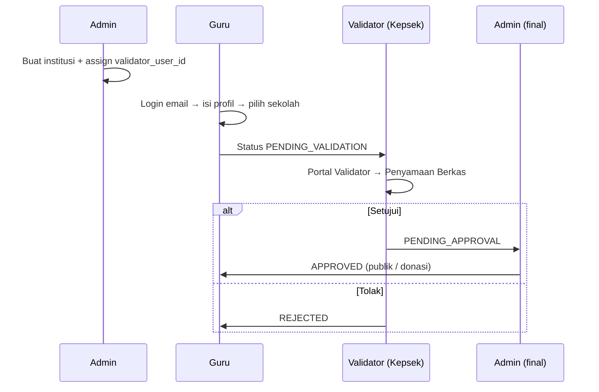

# Auth & Alur Bisnis Bea Guru

## Prinsip auth

- **Identitas = email** (tanpa password di lingkungan dev/staging saat ini).
- User **harus sudah terdaftar** di tabel `users` (oleh Admin / seed / nanti onboarding).
- Login: kirim email → backend cek DB → buat **session cookie** `bea_guru_sid` → portal sesuai **role** RBAC.

> Produksi nanti: email yang sama bisa dipakai untuk **magic link** atau OTP; kontrak API tetap `POST /auth/login { "email" }`.

## Role & portal

| Role | Portal FE | Tugas utama |
|------|-----------|-------------|
| `ADMIN` | Dasbor Admin Yayasan | Daftar sekolah, assign validator, approve final guru, keuangan |
| `VALIDATOR` | Portal Kepala Sekolah | Validasi berkas guru **sekolah yang ditugaskan** |
| `TEACHER` | Portal Guru Honorer | Profil, laporan bulanan |
| `DONOR` | Portal Donatur | Donasi, lihat guru & laporan |

Permissions di-load dari `roles` → `role_permissions` → session (`/me`).

## Peta sekolah & validator (dev seed)

```
                    ┌─────────────────────┐
                    │   Admin Yayasan     │
                    │ beaguru07@gmail.com │
                    └──────────┬──────────┘
                               │ daftar sekolah + assign validator
         ┌─────────────────────┼─────────────────────┐
         ▼                     ▼                     ▼
  SDN 1 Harapan          SMP 2 Cita-Cita         SMA 3 Tunas
  validator:             validator:              validator:
  kepsek.sdn1@           kepsek.smp2@            kepsek.sma3@
         │                     │                     │
    Guru A, Guru B         Guru C                  (belum ada antrian)
    (honorer)              (honorer)
```

### Akun demo (email login)

| Email | Peran | Sekolah / cakupan | Status profil guru (jika TEACHER) |
|-------|--------|-------------------|-----------------------------------|
| `beaguru07@gmail.com` | Admin | Seluruh yayasan | — |
| `kepsek.sdn1@bea-guru.dev` | Validator | SDN 1 Harapan Bangsa | — |
| `kepsek.smp2@bea-guru.dev` | Validator | SMP 2 Cita-Cita Luhur | — |
| `kepsek.sma3@bea-guru.dev` | Validator | SMA 3 Tunas Muda | — |
| `guru.a@bea-guru.dev` | Guru Ani (A) | SDN 1 | `PENDING_VALIDATION` → antrian **kepsek.sdn1** |
| `guru.b@bea-guru.dev` | Guru Budi (B) | SDN 1 | `APPROVED` |
| `guru.c@bea-guru.dev` | Guru Citra (C) | SMP 2 | `PENDING_VALIDATION` → antrian **kepsek.smp2** |
| `donor@bea-guru.dev` | Donatur | — | — |

## Alur bisnis guru (validasi)



### Scoping antrian validator

Query backend: guru `PENDING_VALIDATION` yang `institution_id`-nya sekolah dengan `institutions.validator_user_id = user validator yang login`.

- Login **kepsek.sdn1** → hanya Guru A (dan B jika masih pending; seed B sudah approved).
- Login **kepsek.smp2** → Guru C.
- Login **kepsek.sma3** → antrian kosong.

## API auth

| Method | Path | Body | Cookie |
|--------|------|------|--------|
| `POST` | `/api/v1/auth/login` | `{ "email": "guru.a@bea-guru.dev" }` | Set `bea_guru_sid` |
| `POST` | `/api/v1/auth/dev-login` | `{ "role": "TEACHER" }` | (legacy dev) |
| `GET` | `/api/v1/me` | — | Session required |
| `POST` | `/api/v1/auth/logout` | — | Clears session |

## Menjalankan lokal

```bash
make db-ping
make migrate-up   # termasuk 00007 persona emails
make run
```

Login di UI: masukkan email demo atau klik chip persona di halaman Masuk.
